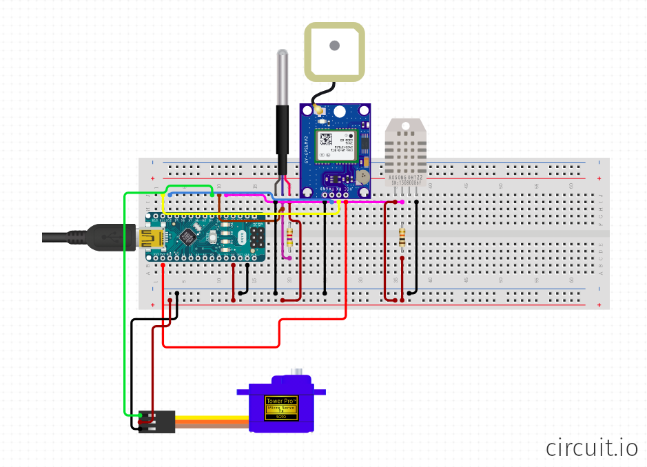

Yachtie HAL
===

This is the hardware abstraction layer for Yachtie. It acts as a serial bridge
between a range of sensors, and the Yachtie firmware running on a Raspberry Pi
0.

Currently, the hardware includes:

* Arduino Nano
* uBlox GPS chip running via SoftwareSerial on pin 4 & 3
* DHT11 on pin 12
* OneWire bus (temperature probe) on pin 11
* Servo for rudder control on pin 10

Messages are input and output in JSON format. This format is not very efficient
for embedded hardware, but is very interoperable with different parts of the
stack. In particular, the main Yachtie application runs Elixir, making it very
easy to receive serial messages and pattern-match the parsed JSON against an
appropriate receiver.

The project makes use of [PlatformIO](https://platformio.org/) for the build
toolchain. PlatformIO must be installed to build and upload the firmware. 

To compile/build:

`platformio build`

To upload:

`platformio upload`

There are several settings that can be configured to control how the firmware is
built and uploaded. These are all well documented in the [PlatformIO
docs](https://docs.platformio.org/en/latest/core/index.html).